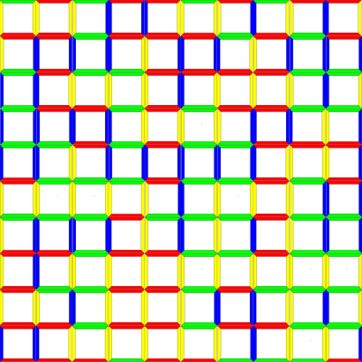

# Wang Tile Texture Generator
## Intro

This project serves as an independent study project for an Advanced Programming for Visual Effects course (C++) at the Savannah College of Art and Design (SCAD). The goal is to create an automatic texture generator through the use of Wang Tiles. Wang Tiles are representations of tiles with coded edges. When tiling a plane with them, only edges with the same code can be placed next to each other. Certain tile sets can aperiodically tile an infinite plane. When translated to textures, we can create seamless, large-scale textures with very little repetition present - a symptom usually of standard tiling methods.

## Example

Below is a tile set of size 16 that can aperiodically tile an infinite plane. Each color: red, green, blue, yellow, is that code for a particular edge of the tile.

 This sample tile set is being used to test the tiling algorithm I have implemented. See a sample output of a 10x10 grid of tiles below:
 
 
 
 As you can see, adjacent edges have the same color, which in this case is a visual representation of the edge codes.
 
 ## To do
 
 Actual synthesis of a texture must now be implemented. The goal is to allow input of a single "source" texture bitmap that can then be broken apart and reconstructed into an appropriate Wang Tile set  (multiple tiles, 16+) that can aperiodically tile a plane of arbitrary size.
