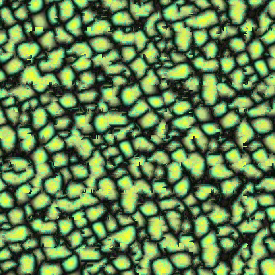

# Wang Tile Texture Generator
## Intro

This project serves as an independent study project for an Advanced Programming for Visual Effects course (C++) at the Savannah College of Art and Design (SCAD). The goal is to create an automatic texture generator through the use of Wang Tiles. Wang Tiles are representations of tiles with coded edges. When tiling a plane with them, only edges with the same code can be placed next to each other. Certain tile sets can aperiodically tile an infinite plane. When translated to textures, we can create seamless, large-scale textures with very little repetition present - a symptom usually of standard tiling methods.

## Example

Below is a tile set of size 16 that can aperiodically tile an infinite plane. Each color: red, green, blue, yellow, is that code for a particular edge of the tile.

 This sample tile set is being used to test the tiling algorithm I have implemented. See a sample output of a 10x10 grid of tiles below:
 
 
 
 As you can see, adjacent edges have the same color, which in this case is a visual representation of the edge codes.
 
## Texture Synthesis

Texture synthesis is based on the image quilting algorithm presented by Efros and Freeman in their paper ["Image Quilting for Texture Synthesis and Transfer"](https://www2.eecs.berkeley.edu/Research/Projects/CS/vision/papers/efros-siggraph01.pdf).

This is not fully implemented correctly yet. Ideally, the seam would be the *cumulative* least cost path through the overlap surface of 2 patches. However, due to time constraints I have resorted to implementing 2 different, simpler methods.

The first chooses the least cost pixel at one end of the overlap surface, and works its way up from there, with a max offset from one point along the cut to another of +/- 1. This makes the cut seem continuous.

The other method picks the least cost pixel at every single location as we travel in either x/y, meaning the resulting cut does not seem continuous, but rather very jagged.

This is the input image that patches are extracted from. The images below show the results of "quilting" said patches together.

 
 Method 1 (visible seams - since this is quite unlikely to be the least cost cut)

 
 Method 2 (barely any seams, but a lot of artifacts due to ragged cut edges)
 
 
 
 500x500 output using Method 2
